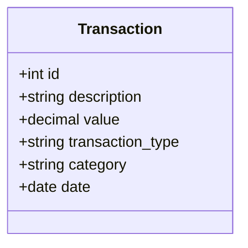
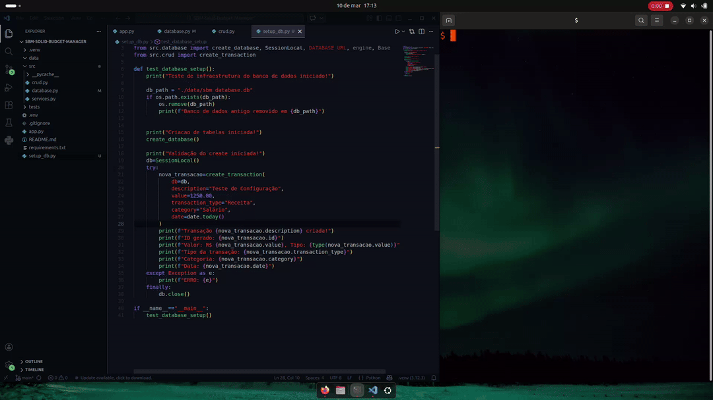

# SBM-Solid-Budget-Manager
Sistema completo de gestão financeira com Python, Streamlit e SQLAlchemy. Focado em arquitetura limpa e segurança.
# 💰 Gerenciador Financeiro

Sistema de gestão financeira pessoal focado em **Integridade de Dados** e **Arquitetura Escalável**.

## 🚀 Tecnologias Utilizadas
* **Linguagem:** Python 3.10+
* **Interface:** Streamlit (Web UI)
* **Backend/API:** FastAPI (Implementação Futura)
* **Banco de Dados:** SQLite com SQLAlchemy (ORM)
* **Segurança:** BCrypt para senhas e JWT para sessões.

## 🏗️ Arquitetura do Projeto
O projeto segue o padrão de **Separação de Preocupações (SoC)**:
- `src/database.py`: Infraestrutura: Configuração da conexão e Session
- `src/models.py`: Esquema: Definição das tabelas e entidades (ORM)
- `src/repository.py`: Persistência: Operações diretas de I/O no banco (CRUD)
- `src/services.py`: Negócio: Lógica, validações e regras do sistema
- `app.py`: Apresentação: Interface do usuário (UI) via Streamlit.

## 🛠️ Como rodar o projeto
(Em breve instruções de instalação...)

## 📋 Lista de Tarefas
- [x] Fundação e Arquitetura
    - [x] Configuração do ambiente virtual e Git. 
    - [x] Definição da arquitetura de pastas e modularização.
    - [x] Validação da Infraestrutura: Automação do Setup do Banco de Dados.

- [x] Camada de Dados (Infraestrutura e Schema)
    - [x] database.py: Configuração do Engine SQLAlchemy e SessionLocal.
    - [x] models.py: Mapeamento ORM da Entidade Transaction.
    - [x] setup_db.py: Script para Garantia da Qualidade (QA) da Infraestrutura.

- [ ] Camada de Persistência - Repository Pattern (repository.py)
    - [x] Design Decision: Separação de Responsabilidades (SoC)
    - [x] Função save_transaction (Persistência básica).
    - [/] Função para listar todas as transações (Query All).
    - [ ] Função para deletar transação por ID (Delete).

- [ ] Camada de Serviço - Lógica de Negócio (services.py)
    - [x] Implementação do módulo de criação (create_transaction_service)
    - [ ] Validações de entrada: Impedir valores negativos ou descrições vazias.
    - [ ] Cálculo de saldo consolidado (Regra de Negócio).
    - [ ] Processamento de dados para Dashboard (Agrupamentos).

- [ ] Interface do Usuário (app.py - Streamlit)
    - [ ] Criação do formulário de entrada de dados.
    - [ ] Desenvolvimento da tabela de exibição de histórico.
    - [ ] Dashboard Visual:
        - [ ] Gráfico de pizza por categoria.
        - [ ] Gráfico de evolução mensal de gastos.
    - [ ] Filtros de data e tipo de transação.

- [ ] Evolução de Escopo: API e Segurança
    - [ ] Migração da lógica para FastAPI.
    - [ ] Sistema de Autenticação (JWT + BCrypt).
    - [ ] Proteção de rotas e isolamento de dados por usuário.

- [ ] Qualidade e Deploy
    - [ ] Escrita de testes unitários com pytest.
    - [ ] Implementação de logs de erro.
    - [ ] Deploy da aplicação (Streamlit Cloud ou Docker).

## 📊 Modelagem de Dados (UML)

Para garantir a integridade das transações financeiras, a estrutura das tabelas foi desenhada da seguinte forma:

## 🧠 Decisões de Design

Nesta seção, detalho as escolhas técnicas feitas para garantir que o **SBM** seja robusto e escalável.

> ### Planejamento:
- **Integridade Monetária**: Uso do tipo `Numeric` para manipulação de valores financeiros, garantindo precisão decimal.

> ### Desenvolvimento:

- **Criação da Engine**: `check_same_thread": False` permite que o SQLite trabalhe com o modelo assíncrono do FastAPI/Streamlit.

- **Configuração de Sessão**: `autoflush=False` e `autocommit=False` para garantir que as alterações só sejam persistidas após validações completas na camada de serviços.

- **Modelo Transaction**: minimiza a perda de precisão numérica ao utilizar `asdecimal=True` na coluna `value` garantindo o tratamento adequado do tipo numérico mapeando os valores da classe `decimal.Decimal`.

- **Setup do Banco de Dados**: Para garantir que a infraestrutura está correta, utilize o script de setup que valida a conexão e a estrutura das tabelas.

- **Implementação do SoC(Separation of Concerns)**:Originalmente, a lógica de persistência e de negócio estavam acopladas em uma única função. Refatorei a arquitetura para isolar as responsabilidades adicionando:
    - Repository Layer: Responsável pelas operações de I/O e integridade do banco de dados.
    - Service Layer: Responsável pela organização e validação das regras de negócio.
    - Models: Responsável pela definição das entidades e do sistema de dados, utilizando o mapeamento ORM para garantir a consistência estrutural entre o código e o banco de dados.
    - database.py: Alterado para gerenciar apenas o ciclo de vida da conexão com o banco de dados e a criação da `SessionLocal`.

    Esta alteração aumenta a manutenabilidade do sistema.

- **database.py(Pós-reestruturação do projeto)**: Após a adaptação para o SoC o databse.py foi alterado para conter apenas a configuração da `engine` e `sessionlocal`, definição da `base` para os modelos e a criação da função que cria o banco de dados e faz a injeção de dependência do mesmo, assegurando assim que cada uma das conexões com ele serão devidamente fechadas.

- **models.py(Pós-reestruturação do projeto)**: Após a adaptação para o SoC o models.py ficou responsável pela definição da estrutura das tabelas(o schema).

- **repository.py(Pós-reestruturação do projeto)**: Após a adaptação para o SoC o repository.py ficou responsável por receber o objeto de transaction e o salva no banco de dados(persistência) fazendo o rollback da ação caso alguma exception ocorrer.

- **services.py(Pós-reestruturação do projeto)**: Após a adaptação para o SoC o services.py valida os dados com base na lógica de negócios fazendo a ponte do app.py com a chamada para o banco de dados poupando chamadas desnecessárias e economizando processamento.